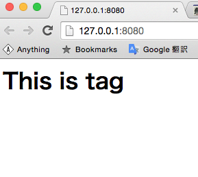

# Web-Componentsを理解するため、自作してみる(1)
最近流行りのwebcomponents。その仕組みを理解すべく、簡単なサンプルを作ってみようと思います。

一回目は純粋に独自タグを読み込んで入れるだけという例。

```index.html
<script src='https://code.jquery.com/jquery-2.1.4.min.js'></script>
<chat></chat>
<script>
  (function(argument) {
    $.get('chat.tag', function(data) {
      $('chat').html(data)
    })
  })()
</script>

```

```chat.tag
<h1>This is tag</h1>

```

見ての通り、jQueryで独自タグを見つけ、```$.get```でそのタグをとってくるというシンプルな処理。結果はこんな感じ



できてますね。次は```.tag```ファイル内部でjsを実行してみます。

```chat.tag

```
