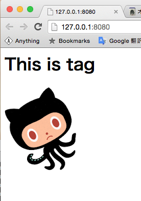

# Web-Componentsを理解するため、自作してみる(1)
現在、ユーザが独自タグを投稿して、利用者がそれらを組み合わせるだけでwebアプリができるプラットフォームを構想中しています。  
そこで必要になる技術がwebcomponents。その仕組みを理解すべく、簡単なサンプルを作ってみようと思います。

一回目は純粋に独自タグを読み込んで入れるだけという例。

```index.html
<script src='https://code.jquery.com/jquery-2.1.4.min.js'></script>
<chat></chat>
<script>
  (function(argument) {
    $.get('chat.tag', function(data) {
      $('chat').html(data)
    })
  })()
</script>

```

```chat.tag
<h1>This is tag</h1>

```

見ての通り、jQueryで独自タグを見つけ、```$.get```でそのタグをとってくるというシンプルな処理。結果はこんな感じ


できてますね。次は```.tag```ファイル内部でjsを実行してみます。

```chat.tag
<h1>This is tag</h1>
<script>
  var ele = document.createElement("img");
  ele.setAttribute("src", "public/oct.png"); // ele.src = "./image/picture/bg01.gif";
  document.body.appendChild(ele);
</script>

```



きちんと画像が挿入されましたね。成功です。


勘の鋭い方ならもう気付いたかもしれませんが、これだと```.tag```からdocument.bodyに挿入しています。あるいは、できてしまいます。個人開発ならば問題ないんですが、コンポーネントを投稿してもらう際に、他のHTMLをいじられる懸念が生まれます。

第二回ではWebWorkerを使ってこのスコープ問題を解決したいと思います。お楽しみに。
